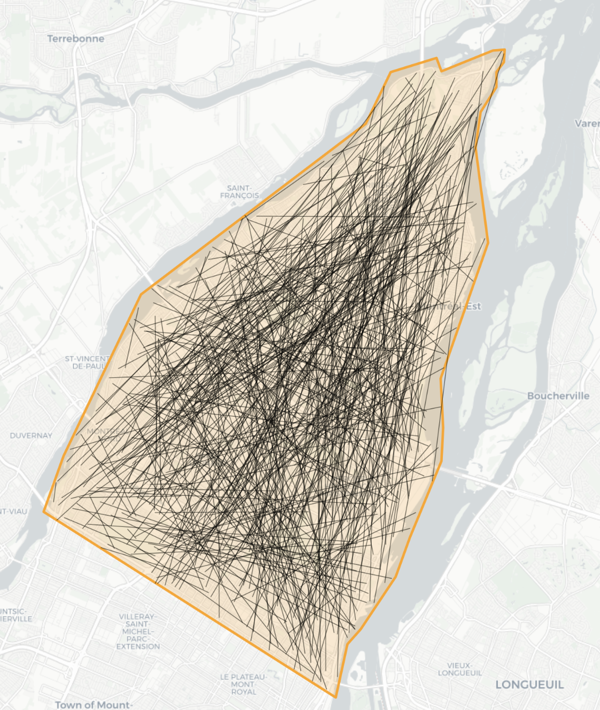

# Bicycle network design optimization

# Authors
1. David Murray, master's student at Polytechnique Montréal's [Mobility research chair](https://www.polymtl.ca/mobilite/)
2. Catherine Morency, PhD. Full professor and holder of the Mobility research chair.

# Questions
For any questions about the usage of this code, please open an issue in this repository

# Documentation
In addition to the README.md files in this repository, three other files are available as documentation:
1. [David Murray's master thesis](https://drive.google.com/file/d/1kTuoGaPsiHiOmf9ruYX4MlUdnu9qzl8k/view?usp=sharing) (in French only)
2. [TRB paper](https://drive.google.com/file/d/1VVYe4lEfTFNjvyqU_ZGSat-2CQGjj8sk/view?usp=sharing), presented at the 2024 TRB annual meetings.
3. [TRB poster](https://drive.google.com/file/d/1oawVAlYTGGMUJUdXUWnlu9ihhyC-V1K7/view?usp=sharing), presented at the 2024 TRB annual meetings.

# Code download and python environment setup
1. Install Python (follow instructions on https://www.python.org/downloads/)

Then, inside a terminal:
2. Clone the code from GitHub: `git clone https://github.com/davidmurray/cycling-network-design.git`
3. Change to the cloned directory: `cd cycling-network-design`
4. Create a virtual environment: `python -m venv .`
5. Activate the virtual environment: `source bin/activate` (note: command may differ on Windows)
6. Install the required packages: `pip install -r requirements.txt`

# Data preparation
The `code/data_preparation.py` Python script prepares the data necessary for the optimization process.

```bash
Parameters:

    --zone_polygon: Path to the GeoJSON file containing the area of the zone (required).
    --od_data: Path to the CSV file containing OD demand data (required).
    --output_directory: Path to the directory where the generated files will be saved (required).
    --local_crs: EPSG code for the local coordinate system (default: epsg:2950).
    --minimum_euclidean_distance: Minimum euclidean distance of trips to be retained (default: 1000 meters).
    --verbose: Enable verbose mode (default: False).
```

## Prerequisites
2. A polygon that defines the boundary of the area to optimize. Must be provided in GeoJSON format. An example is availble in the `examples/` folder.
1. OD demand data in csv format. Your data can have many columns, but must at the very least have the `lonorig`, `londest`, `latorig` and `latdest` columns in WGS84 coordinates. An example demand file is provided in the `examples/` folder, which defines 500 randomly generated OD lines in the given polygon. See image below for a visualisation of the polygon and OD data.
  


## Usage

To run the script, use the following command in your terminal:

```bash

python code/data_preparation.py --zone_polygon /path/to/your/zone.geojson --od_data /path/to/your/od_data.csv --output_directory
```

Example output (with `verbose` turned on):
```bash
python code/data_preparation.py --zone_polygon test/boundary.geojson --od_data test/od_bike2018.csv --output_directory data/ --verbose
Starting data preparation for args test/boundary.geojson saving data to data/
  G = ox.graph_from_polygon(zone_polygon,
2024-01-02 12:10:07 Projected GeoDataFrame to 'EPSG:32618 / WGS 84 / UTM zone 18N'
2024-01-02 12:10:07 Projected GeoDataFrame to 'EPSG:4326 / WGS 84'
2024-01-02 12:10:07 Projected GeoDataFrame to 'EPSG:32618 / WGS 84 / UTM zone 18N'
2024-01-02 12:10:07 Projected GeoDataFrame to 'EPSG:4326 / WGS 84'
2024-01-02 12:10:07 Requesting data from API in 1 request(s)
2024-01-02 12:10:08 Retrieved response from cache file 'cache/0aa1f78f171879d4c08c90a41bba2a9c76189214.json'
2024-01-02 12:10:09 Retrieved all data from API in 1 request(s)
2024-01-02 12:10:09 Creating graph from 149,202 OSM nodes and 47,215 OSM ways...
2024-01-02 12:10:15 Created graph with 149,202 nodes and 359,054 edges
2024-01-02 12:10:17 Added length attributes to graph edges
2024-01-02 12:10:17 Identifying all nodes that lie outside the polygon...
2024-01-02 12:10:20 Created nodes GeoDataFrame from graph
2024-01-02 12:10:20 Built r-tree spatial index for 149,202 geometries
2024-01-02 12:10:20 Accelerating r-tree with 6 quadrats
2024-01-02 12:10:23 Identified 146,951 geometries inside polygon
2024-01-02 12:10:27 Removed 1,839 nodes outside polygon
2024-01-02 12:10:27 Truncated graph by polygon
2024-01-02 12:10:27 Identifying all nodes that lie outside the polygon...
2024-01-02 12:10:35 Created nodes GeoDataFrame from graph
2024-01-02 12:10:36 Built r-tree spatial index for 147,363 geometries
2024-01-02 12:10:36 Accelerating r-tree with 4 quadrats
2024-01-02 12:10:42 Identified 129,767 geometries inside polygon
2024-01-02 12:10:49 Removed 17,297 nodes outside polygon
2024-01-02 12:10:49 Truncated graph by polygon
2024-01-02 12:10:51 Counted undirected street segments incident on each node
2024-01-02 12:10:52 graph_from_polygon returned graph with 130,066 nodes and 313,758 edges
2024-01-02 12:10:56 Created nodes GeoDataFrame from graph
2024-01-02 12:10:57 Projected GeoDataFrame to 'EPSG:2950 / NAD83(CSRS) / MTM zone 8'
2024-01-02 12:11:01 Created edges GeoDataFrame from graph
2024-01-02 12:11:16 Created graph from node/edge GeoDataFrames
2024-01-02 12:11:16 Projected graph with 130066 nodes and 313758 edges
Dropped 27385 (81.2 %) trips. Remaining trips: 6356
2024-01-02 12:11:50 Created nodes GeoDataFrame from graph
2024-01-02 12:12:01 Created nodes GeoDataFrame from graph
2024-01-02 12:12:15 Counted undirected street segments incident on each node
2024-01-02 12:12:20 Created edges GeoDataFrame from graph
2024-01-02 12:12:30 Saved graph as GraphML file at PosixPath('data/G_consolidated.graphml')
2024-01-02 12:12:30 Begin topologically simplifying the graph...
2024-01-02 12:12:30 Identified 435 edge endpoints
2024-01-02 12:12:31 Simplified graph: 6,276 to 435 nodes, 13,440 to 1,758 edges
2024-01-02 12:12:32 Begin topologically simplifying the graph...
2024-01-02 12:12:32 Identified 372 edge endpoints
2024-01-02 12:12:32 Simplified graph: 435 to 372 nodes, 1334 to 1208 edges
2024-01-02 12:12:32 Created edges GeoDataFrame from graph
2024-01-02 12:12:33 Converted MultiDiGraph to undirected MultiGraph
2024-01-02 12:12:33 Saved graph as GraphML file at PosixPath('data/G_simplified.graphml')
2024-01-02 12:12:33 Created nodes GeoDataFrame from graph
2024-01-02 12:12:33 Created edges GeoDataFrame from graph
  osm_xml._save_graph_xml(
2024-01-02 12:12:37 Saved graph as .osm file at PosixPath('data/osrm_network.xml')
```

# Optimization
  
The main Python script of this project is `genetic_algorithm.py`, located in the `code/` subfolder. This code is the crux of this research: given a set of parameters, it will design the best cycling network for a given territory.

## Prerequisites
Before using this script, you must complete the data preparation step outlined above in this file.

## Parameters
```bash
python code/genetic_algorithm.py -h
usage: Genetic algorithm [-h] [-a] [--optuna_log OPTUNA_LOG] [--random_search | --no-random_search] [--random_search_output RANDOM_SEARCH_OUTPUT] [-d] --data_folder DATA_FOLDER
                         [--value_of_time VALUE_OF_TIME] [--unreachable_trip_cost UNREACHABLE_TRIP_COST] [--output_folder OUTPUT_FOLDER] [--n_workers N_WORKERS] [--n_pop N_POP]
                         [--n_gen N_GEN] [--n_runs N_RUNS] [--checkpoint_freq CHECKPOINT_FREQ] [--runtime_limit RUNTIME_LIMIT] [--save_genealogy] [--walking_speed WALKING_SPEED] [--cxpb CXPB]
                         [--mutpb MUTPB] [--n_elites_prop N_ELITES_PROP] [--tourn_size TOURN_SIZE] [--max_cycling_length_prop MAX_CYCLING_LENGTH_PROP]
                         [--constraint_penalty CONSTRAINT_PENALTY] [--max_gen_no_improvement MAX_GEN_NO_IMPROVEMENT] [--min_delta_improvement MIN_DELTA_IMPROVEMENT]
                         [--mate {probabilisticGeneCrossover,tripsBasedCrossover,cxOnePoint,cxTwoPoint}] [--mutation_rate_type {constant,exponential_decay,step_decrease}]
                         [--mutpb_decay_rate MUTPB_DECAY_RATE] [--mutpb_step_decrease_gamma MUTPB_STEP_DECREASE_GAMMA]

options:
  -h, --help            show this help message and exit
  -a                    Perform hyperparameter optimization using Optuna
  --optuna_log OPTUNA_LOG
                        Path to optuna log file. File name must end in .log
  --random_search, --no-random_search
                        Generate --n_pop individuals randomly and measure their fitness
  --random_search_output RANDOM_SEARCH_OUTPUT
                        File path where to save report of random search
  -d, --debug           Print a lot of debugging statements
  --data_folder DATA_FOLDER
                        The folder containing the input data created during the data preparation step.
  --value_of_time VALUE_OF_TIME
                        Value of time in model [default: 10 $/h]
  --unreachable_trip_cost UNREACHABLE_TRIP_COST
                        Value of unreachable trip in model [default: 30 $]
  --output_folder OUTPUT_FOLDER
                        Folder where to output optimization results
  --n_workers N_WORKERS
                        Number of workers to use for parallel network quality evaluation. Use number of CPUs available on system [default: 2]
  --n_pop N_POP         Size of population
  --n_gen N_GEN         Number of genetic algorithms generations to run for. Early stopping possible with --runtime_limit, or combination of --max_gen_no_improvement and
                        --min_delta_improvement
  --n_runs N_RUNS       Number of optimization runs of the to perform [default: 1]
  --checkpoint_freq CHECKPOINT_FREQ
                        Save a checkpoint after X numbers of generations [default: 1]. Will overrite previous checkpoint.
  --runtime_limit RUNTIME_LIMIT
                        Max runtime (in seconds) for each genetic algorithm execution [default: 3 hours]
  --save_genealogy      Save genealogy tree during genetic algorithm run. Has not really been tested properly though.
  --walking_speed WALKING_SPEED
                        Walking speed in km/h [default: 5 km/h]
  --cxpb CXPB           Crossover probability [default: 0.569]
  --mutpb MUTPB         Mutation probability [default: 0.092]
  --n_elites_prop N_ELITES_PROP
                        Proportion of elites probability [default: 0.2]
  --tourn_size TOURN_SIZE
                        Size of tournament for individuals selection [default: 20]
  --max_cycling_length_prop MAX_CYCLING_LENGTH_PROP
                        Maximum size of cycling network (for budgetary constraint) as a proportion of the length of all edges in input network [default: 0.25]
  --constraint_penalty CONSTRAINT_PENALTY
                        Value to add to fitness of individuals which do not respect the budgetary constraint [default: 500000]
  --max_gen_no_improvement MAX_GEN_NO_IMPROVEMENT
                        Terminate optimization after X generations with negligable improvement (see also --min_delta_improvement) [default: 30]
  --min_delta_improvement MIN_DELTA_IMPROVEMENT
                        What to consider to be a meaningful improvement in fitness, in percentage (see --max_gen_no_improvement) [default: 0.005]
  --mate {probabilisticGeneCrossover,tripsBasedCrossover,cxOnePoint,cxTwoPoint}
                        Crossover method [default: probabilisticGeneCrossover]
  --mutation_rate_type {constant,exponential_decay,step_decrease}
                        Mutation decrease method [default: step_decrease]
  --mutpb_decay_rate MUTPB_DECAY_RATE
                        Mutation decay rate for exponential_decay method [default: 0.95]
  --mutpb_step_decrease_gamma MUTPB_STEP_DECREASE_GAMMA
                        Mutation step reduction for step_decrease method [default: 0.858]
```

## Usage
This script has two main modes:
1. Hyperparameter optimization mode
2. One-off mode (or "manual" mode)

In manual mode, you must supply the values of every hyperparameter, for instance the size of the population (`--n_pop X`), crossover probability (`--cxpb Y`), the mutation probability (`--mutpb Z`), etc. If you do not provide values for all hyperparameters, defaults will be used, but optimization results will likely be terrible because genetic algorithms are highly sensible to the choice of hyperparameters.

Therefore, we recommend first using the hyperparameter optimization mode to find the optimal genetic algorithm hyperparameters for a given territory. Once this is done and the best hyperparameters are identified, you can then use these parameters in one-off mode and experiment with varying the value of time $C_time$ and the cost of an unsatified trip $C_UT$, which are the main parameters in the model. The role and impact of these parameters is explained in depth in the documentation links provided above in this README file. 

### Running in hyperparameter optimization mode mode
This mode will use the [Optuna](https://optuna.readthedocs.io/) library to find the best hyperparameters for the genetic algorithm. Internally, this uses the [Tree-structured Parzen Estimator (TPE)](https://proceedings.neurips.cc/paper_files/paper/2011/file/86e8f7ab32cfd12577bc2619bc635690-Paper.pdf) sampler to suggest promising hyperparameter combinations. Note: this mode roughly involves running the genetic algorithm for ten times for each hyperparameter configuration. Since each run of the genetic algorithm can take hours of calculation even on a computing cluster, finding optimal hyperparameters with this procedure may take several days (or even weeks) of calculations. We recommend letting the script test at least 40 hyperparameter combinations. 

After activating the Python environment (generally `source bin/activate`)
```bash
python code/genetic_algorithm.py \
  --data_folder data/ \
  --output_folder output/ \
  -d \
  -a \
  --optuna_log optuna-logfile.log \
  --n_workers 1
```

Meaning of each parameter:
* `--data_folder`: folder containing input data (from the _data preparation_ step)
* `--output_folder`: folder where to save the data from all attempted trials and runs
* `-d`: Run in debug mode which will print useful debugging information to the terminal
* `-a`: Run in hyperparameter optimization mode 
* `--optuna_log`: Location where to save the Optuna logfile (will contain info about attempted trials and results)
* `--n_workers`: Number of workers to use for calculations

### Running in one-off (or "manual" mode)
This mode should be used once the hyperparameter optimization is completed and a sufficiently good hyperparameter combination has been found. Once this is the case, this mode and be used to run the genetic algorithm with different values for the model parameters.
